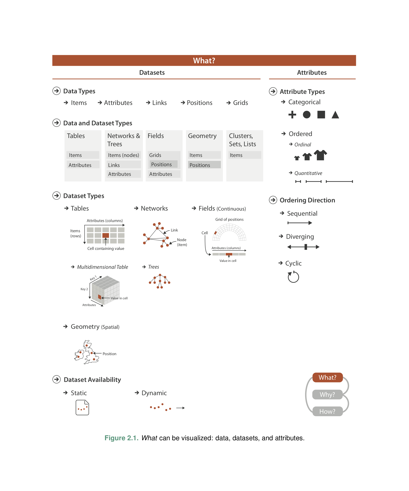
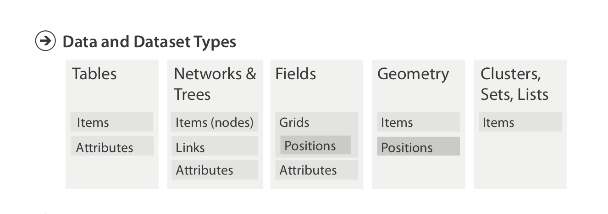
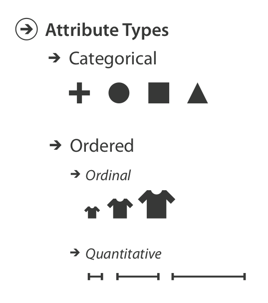

# Big Picture

[</img>](lx02/big_picture.png)

## Important Concepts

Four basic dataset types

: **Tables** / **Networks** / **Fields** / **Geometry** +  and three more: Clusters / Sets / Lists

Five data types

: **Items** / **Attributes** / **Links** / **Positions** / **Grids**

Where from

: Static file / Stream

Attribute types

: **Categorical** / **Ordered** (**Ordinal** / **Quantitative**)

    Ordering Direction: Sequantial / Diverging / Cyclic

# Data Semantics vs Data Types

## Example: **Data Sematics** (1/2)

これは何？

<code>14, 2.6, 30, 30, 15, 100001</code>

## Example: **Data Semantics** (2/2)

では、こちらは？

<code>Basil, 7, S, Pear</code>

::: incremental

- 今月7日にバジルと桃の積荷が届いた (shipping)

- 近隣のBasil Point 区に7インチの積雪があったので、Pear Creek有限会社に除雪してもらった

- Basilという名前の実験用ネズミが迷路の南側に桃を置いた設定で7回脱出に成功した

:::

## **Semantics** and **Types**

Semantics

: Real world meaning

Types

: Structural and mathematical interpretation

## Does "3 + 5" makes sense?

::: incremental

- 家に3個のインスタントラーメンがありました。 
    母がスーパーでさらに5個買い足しました。 
    家には3 + 5 = 8個のインスタントラーメンがあります。

- 私と友人のスーパージャンボ宝くじの番号はそれぞれ215番と562番でした。 
    宝くじの当選番号は777番です。 
    215+562=777に気づいたぼくらは狂喜乱舞しました。ぼくらは大金持ちです。

:::

# Data Types

- Items
- Attributes
- Links
- Positions
- Grids

## Items

Items

: 個々の存在: 表のデータ項目、ネットワーク構造の頂点

Attributes

: 測定、観測、記録可能な性質

Links

: Item -- Item 間の関係（集合論的関係: $a \,R\, b$）

Positions

: 2D/3D空間において場所を与える空間的データ

Grids

: 連続的データ分布からのサンプリング戦略

# Dataset Types

- Tables
- Networks & Trees
- Fields
- Geometry
- Others: { Clusters, Sets, Lists }

## Figure 2.3: Data and Dataset Types

</img>

## Figure 2.3: Data and Dataset Types

Tables

:  $\text {Items} \times \text {Attributes} \rightarrow \text {Value}$

Networks $(V, E)$

:   - $(\text {Items}, \text {Items} \times \text {Items})$

    - Node attributes: $\text {Items} \rightarrow \text {Value(s)}$

    - Link attributes: $\text {Items} \times \text {Items} \rightarrow \text {Value(s)}$

## Figure 2.3: Data and Dataset Types

Fields

: 連続場から（有限のデータで表現するために）サンプリングしたもの

    Scalar fields (X線画像: 2D、fMRI: 3D), Vector fields (風向+風力), Tensor-fields (地殻のひずみ)

    $\text {sampling} \longleftrightarrow \text {interpolation}$

    *Spatial Fields*: 空間的位置についてサンプリングしたもの

    *Grid types* サンプリングの種別:

    Uniform Grid (正方格子) / Rectilinear Grid (直方格子) / Structured Grid (曲線的な形状、例：極座標系における扇形状のサンプリング） / Unstructured Grid: Voronoi分割、行政区画に基づくサンプリング

# Attribute Types

</img>

## Attribute Types と演算

- Categorical: $\equiv$, $\not\equiv$

    - リンゴとミカンと柿、$\left\{\text {学生}_k\right\}_k$

- Ordered ($\prec$): $\subset, \sqsubset$

    - Ordinal: 例：シャツのサイズ (S / M / L / XL)、順位

    - Quantitative ($+$): 首周りの長さ、走行距離、高さ、価格、プログラムのなかの関数の呼び出し回数、カフェでのコーヒーの注文回数

## Ordinal: Sequential versus Diverging

- Sequential: 一方向的な比較

- Diverging: 基準点からの大小比較の概念がある。例: 標高と水面下M

## Cyclic Attributes

- 24時間

- 1週間

- 四半期

- 季節

- 年、公転周期、周期

# Semantics

## Tables の Semantics: Key と Value

- Flat tables: $\text {key} \rightarrow \text {value}$ -- Key の一意性

- Keyは ordinal でも categorical でもよい: *Bar charts* versus *Line charts*

- Multidimensional tables (*independent keys* and *dependent values*)

</img>

## Fields の variables

- 言葉遣いが tables と異なる: *Independent variables* and *Dependent values*

- Tables versus Fields

    Fields は連続場からサンプリングしている。このため特定のセルの値だけでなく、隣接したセルの値の変化に意味がある。Tables の場合は必ずしもそうではない。

- Multivariate Field: *Dependent values* が複数あること

- Multidimensional Field: *Independent variables* が複数あること

## Temporal Semantics
