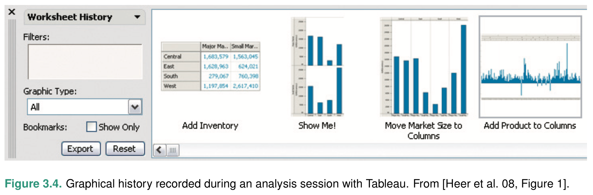
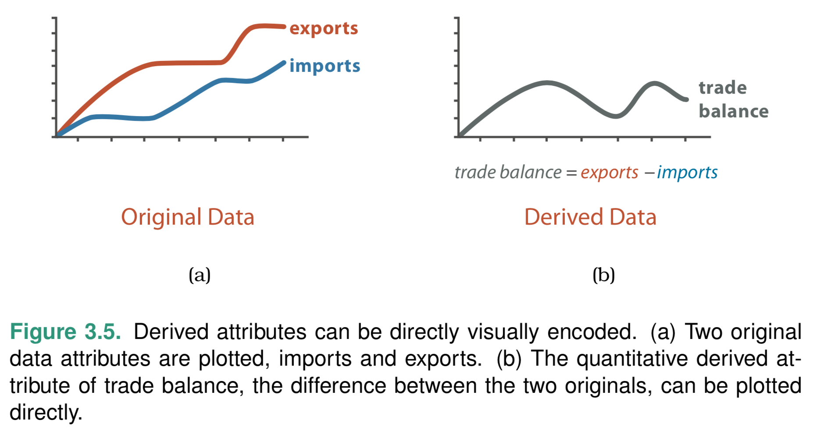
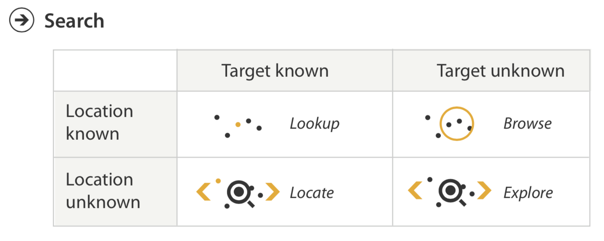

# Analyze Goals

## Discover Goal

## Present Goal

- プレゼンテーションのためにvisを利用するケース (e.g., PowerPoint)

    - 静的な図画
    - ムービー
    - インタラクティブなプレゼンテーション
        - [Hans Rosling's TED talks](https://www.ted.com/talks/hans_rosling_the_best_stats_you_ve_ever_seen?language=ja)

- visを利用して発見した事実をプレゼンテーションするケース。visはプレゼンテーションを意図した機能を提供するとよい。

## Enjoy Goal

## [Many Eyes](https://researcher.watson.ibm.com/researcher/view_group.php?id=7352&mhsrc=ibmsearch_a&mhq=manyeyes)

Many Eyes: [@viegas-2007-manyeyes-a-site-for-visualization-at-internet-scale].

> When you need a new way to {look at things, portray information, highlight critical, change your point of view},
>
> You can turn to Many Eyes.
>
> Many Eyes' collection of data visualization use crowd sourcing to gether together fresh ideas, and then {allows / supports / challenges that community} to develop those ideas even further for themselves and to share with others.
>
> It's collective **sense**making, that makes perfect sense and amazing visualizations.
>
> What can a community help you with many eyes? {refresh / react to / improve / embrace}

## ManyEyes movies

- [How to use ManyEyes](https://www.youtube.com/watch?v=aAYDBZt7Xk0)
    dataset, vis idiom, title, publish, share: email, facebook, twitter, save to image, live visualization

## [baby name wizard](http://www.babynamewizard.com/voyager#prefix=&sw=m&exact=false)

デザイナーの意図を離れてvisが利用されることがしばしばある。

Name Voyager [@wattenberg-2005-baby-names-visualization-and-social-data] は当初、新生児への命名を意図して設計されたが、新生児の親以外の多くの人々が利用している。

# Produce Goals

ただ、眺めるだけでなく、別の何かを得るGoal

## Annotate

ユーザが既存の可視化要素（群）にテキストあるいは視覚的要素を追加すること。（例：散布図のなかの点群を投げ縄で囲って色をつける）

Annotation はユーザによる、属性の付加とも考えられる。

## Record

[</img>](lx03/fig4-record.png)

- ブックマーク
- パラメタ設定
- 対話ログ, Graphical history (上図) -- [@heer-2008-graphical-histories-for-visualization-supporting-analysis]
- 注釈

## Derive

[</img>](lx03/fig5-derive.png)

既存のデータから新しいデータを派生させること。

例: VxInsight
- データ: 6,000種の酵母遺伝子 x 実験条件 → 18種の遺伝子発現レベル
- 派生: 遺伝子発現レベルに関する類似度 > 閾値 → ネットワーク → ネットワーク可視化

# Mid-level goals: Search

[</img>](lx03/fig0-search.png)

- 列：何を探しているのか
- 行：どこに探しものがあるのか

## Lookup

例：進化の系統樹のなかでヒトを探す。脊椎動物 → 哺乳類 → 霊長類 → ヒト

## Locate

居場所がわからない

- 系統樹のなかで[ウサギはどこに](https://ja.wikipedia.org/wiki/哺乳類#分子系統解析による分類)？
- メガネどこいった？
- 犯人はどこに？

## Browse

- 齧歯目にはどんな生き物がいるんだろう？
- 6月15日の株価

## Explore

どこで何を探しているのかわからない状況

- 外れ値の発見
- 階級区分図からの[地理的パターンの発見](https://en.wikipedia.org/wiki/Choropleth_map)

# Query Goals

## Identify

lookup goal, locate goal によって見つかったデータの詳細を眺める

## Compare

複数のデータを比較する補助機能。

例 -- [TDB reports](https://smartnova.github.io/tdb-reports/talks/20191203-tdb/) -- [@wakita-2019-guiding-the-reader-to-statistical-focus-and-context]

## Summarize

データの概要を簡潔にまとめる機能。

例 -- [interactive Map Reports](https://vis-tools.paluno.uni-due.de/imr/) -- [@latif-2019-interactive-map-reports-summarizing-bivariate-geographic]

> iMR is a demonstrator of an approach that leverages natural language text to summarize bivariate map visualizations. It uses text templates that can adapt to various datasets. The generated text and visualizations are combined into an interactive document.

# 参考文献
